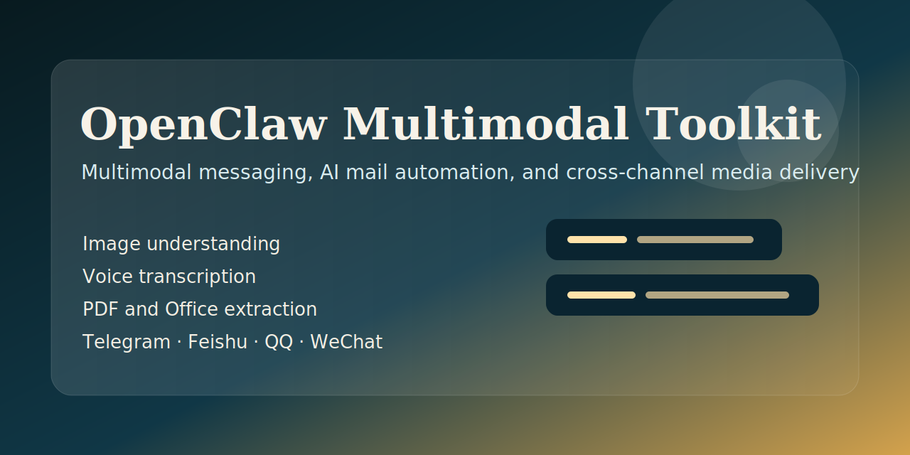

# OpenClaw Multimodal Toolkit

[中文介绍](README.zh-CN.md)




Utilities and skill docs for building OpenClaw-based multimodal workflows across chat channels.

This repository is a cleaned public subset of a real OpenClaw workspace. Private memory files, logs, account identifiers, and local state were removed before publishing.

## Highlights

- Multimodal message understanding for images, audio, PDFs, Office files, and text files
- AI-assisted IMAP mail reply workflow
- Cross-channel image delivery for Telegram, Feishu, QQ, and WeChat
- Reference OpenClaw Web app merged as a sanitized sub-application
- OpenClaw-oriented skill docs and deployment examples
- Additional OpenClaw integration notes and OneBot plugin references

## Included Components

- `multimodal-agent.py`
  Compatibility wrapper for the multimodal processor in `scripts/`.
- `mail-agent.py`
  Compatibility wrapper for the mail automation entrypoint in `scripts/`.
- `image_sender.py`
  Compatibility wrapper for the image delivery helper in `scripts/`.
- `scripts/`
  Actual runnable script implementations kept together in one place.
- `src/openclaw_multimodal_toolkit/`
  Lightweight package metadata and module-based CLI entrypoint.
- `skills/`
  OpenClaw skill docs for multimodal messaging, image generation delivery, and OneBot integration.
- `apps/openclaw-web/`
  Sanitized reference web application merged from the standalone `openclaw-web` repository.
- `deploy/`
  Example environment and `systemd` assets for scheduled mail-agent deployment.
- `docs/`
  Integration notes for wiring the toolkit into an OpenClaw setup.

## Repository Layout

```text
.
├── assets/
├── apps/
├── deploy/
├── docs/
├── image_sender.py
├── mail-agent.py
├── multimodal-agent.py
├── pyproject.toml
├── requirements.txt
├── scripts/
├── src/
├── skills/
└── README.zh-CN.md
```

## Requirements

- Python 3.10+
- OpenClaw CLI available in `PATH`
- `uvx minimax-coding-plan-mcp`
- Tesseract OCR
- Poppler utilities for `pdf2image`
- Optional local `faster-whisper` model cache for faster transcription

## Installation

Install Python dependencies:

```bash
pip install -r requirements.txt
```

Optional editable install:

```bash
pip install -e .
```

Copy environment template:

```bash
cp .env.example .env
```

Fill in the values you actually use before running anything.

## Configuration

Important environment variables:

- `MINIMAX_API_KEY`
- `MINIMAX_API_HOST`
- `MINIMAX_URL`
- `MINIMAX_MODEL`
- `MAIL_AGENT_EMAIL_ACCOUNT`
- `MAIL_AGENT_EMAIL_PASSWORD`
- `MAIL_AGENT_TOKEN`
- `BRAVE_API_KEY`
- `MAIL_AGENT_NOTIFY_TARGETS`

`MAIL_AGENT_NOTIFY_TARGETS` expects a JSON array:

```json
[
  {"channel":"telegram","target":"telegram:<user_id>"},
  {"channel":"feishu","target":"<open_id>"}
]
```

See also:

- [Chinese introduction](README.zh-CN.md)
- [OpenClaw integration notes](docs/OPENCLAW_INTEGRATION.md)
- [OpenClaw Web reference app](apps/openclaw-web/README.md)
- [Deployment examples](deploy/)

## Usage

Transcribe voice:

```bash
python3 multimodal-agent.py voice /path/to/audio.mp3
```

Process a file:

```bash
python3 multimodal-agent.py file /path/to/file.pdf
```

Modify a file with natural language:

```bash
python3 multimodal-agent.py modify /path/to/file.txt "Change the title to Q2 summary"
```

Deliver an image:

```bash
python3 image_sender.py /path/to/image.jpg telegram <telegram_user_id> "caption"
```

Module-based CLI:

```bash
python -m openclaw_multimodal_toolkit.cli multimodal voice /path/to/audio.mp3
python -m openclaw_multimodal_toolkit.cli image-sender /path/to/image.jpg telegram <telegram_user_id>
```

## Project Positioning

This repository is intentionally positioned as a practical integration toolkit:

- not a generic SDK
- not a polished framework yet
- useful as working reference code for OpenClaw-centric automation

It is most valuable if you want to adapt proven scripts, deployment snippets, and skill docs rather than adopt a large abstraction layer.

## OpenClaw-Specific Assumptions

This toolkit assumes an OpenClaw-style environment in a few places:

- local OpenClaw config under `~/.openclaw/`
- `openclaw message send` available as a CLI
- MiniMax MCP launched through `uvx minimax-coding-plan-mcp`
- channel delivery conventions matching OpenClaw plugins

If you want to reuse the scripts outside OpenClaw, expect to patch paths, config lookup, and message delivery adapters.

## Security Notes

- This public version intentionally excludes secrets, memory snapshots, queue data, and logs.
- Notification targets are configured through environment variables instead of hardcoded personal IDs.
- Review channel-delivery code before using it in another environment with different trust boundaries.

## Related Sections

- [Chinese introduction](README.zh-CN.md)
- [OpenClaw integration notes](docs/OPENCLAW_INTEGRATION.md)
- [OpenClaw Web reference app](apps/openclaw-web/README.md)
- [OneBot skill](skills/openclaw-onebot/SKILL.md)
- [Deployment examples](deploy/)

## License

[MIT](LICENSE)
