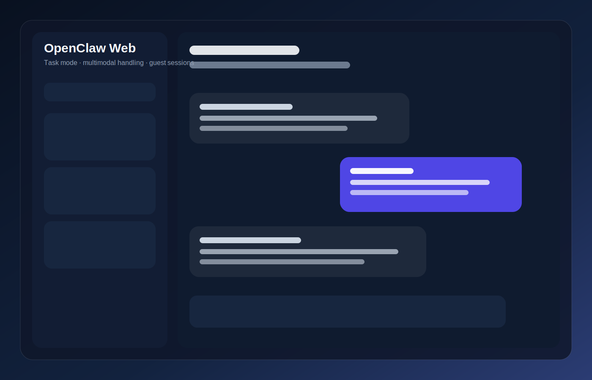

# OpenClaw Web

[中文说明](#中文) | [English](#english)




---

## 中文

`apps/openclaw-web` 是并入 `OpenClaw Suite` 的一个清洗版 Web 参考应用。

它展示了一个浏览器侧 OpenClaw UI 可以怎么组织：

- 普通对话
- 任务模式
- 游客会话
- 多模态文件上传
- 工件下载

### 功能表

| 功能 | 状态 | 说明 |
|------|------|------|
| AI 对话 | 可用 | 基于 FastAPI 的 Web 聊天界面 |
| 任务模式 | 可用 | 支持后台任务轮询与结果回填 |
| 多模态处理 | 可用 | 图片、语音、文件分析链路 |
| 游客模式 | 可用 | 支持临时 token 和自动清理 |
| 工件下载 | 可用 | 任务结果可挂成下载链接 |
| 图像生成接入 | 可选 | 依赖外部图生/桥接能力 |

### 当前公开化处理

- 移除了硬编码 API key
- 把绝对路径改成环境变量或相对路径
- 去掉数据库、日志、缓存、备份 HTML
- 把个人品牌标题改成通用名称 `OpenClaw Web`

### 目录概览

```text
apps/openclaw-web/
├── app.py
├── task_worker.py
├── task_store.py
├── unified_bridge_core.py
├── static/
├── assets/
├── config_example.env
└── DEPLOYMENT.md
```

### 快速启动

```bash
cd apps/openclaw-web
cp config_example.env .env
python app.py
```

更完整的部署步骤见：

- [DEPLOYMENT.md](DEPLOYMENT.md)

### 适合用途

- 当作 OpenClaw Web 界面的参考实现
- 拆分任务模式 / Web UI / bridge 逻辑
- 作为更完整产品化项目前的中间层

---

## English

`apps/openclaw-web` is a sanitized reference web app merged into `OpenClaw Suite`.

It shows how a browser-facing OpenClaw UI can be structured around:

- normal chat
- task mode
- guest sessions
- multimodal uploads
- downloadable artifacts

### Feature Table

| Feature | Status | Notes |
|--------|--------|-------|
| AI chat | Available | FastAPI-based browser UI |
| Task mode | Available | Background task polling and result backfill |
| Multimodal handling | Available | Image, audio, and file workflows |
| Guest mode | Available | Temporary tokens and cleanup flow |
| Artifact download | Available | Task outputs exposed as downloadable files |
| Image generation bridge | Optional | Depends on external image backend/bridge |

### Public-safety cleanup applied

- removed hardcoded API keys
- replaced absolute production paths with environment-driven or relative paths
- excluded databases, logs, caches, and backup HTML files
- replaced personal branding with the generic app title `OpenClaw Web`

### Layout

```text
apps/openclaw-web/
├── app.py
├── task_worker.py
├── task_store.py
├── unified_bridge_core.py
├── static/
├── assets/
├── config_example.env
└── DEPLOYMENT.md
```

### Quick Start

```bash
cd apps/openclaw-web
cp config_example.env .env
python app.py
```

See also:

- [DEPLOYMENT.md](DEPLOYMENT.md)
